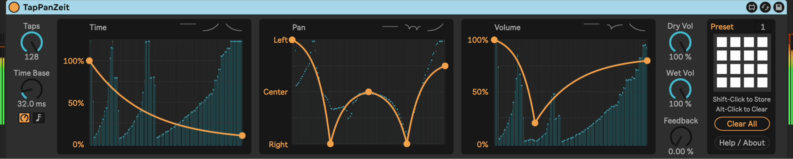

# m4l-TapPanZeit

This is an audio effect made in Max For Live that implements a bucket-brigade multitap (up to 128 individual taps) delay effect with visual control over inter-tap timing and pan position. It can serve as a simple delay, or incredibly complicated combination of the two.

I originally had an idea that there should be a function in a reverb that lets you control the pan position of the reverb tail at specific times after the initial impulse. I didn't find that in the reverbs that I had, so I decided to mock one up. My first attempt was to use an audio effect rack with five chains spread across the stereo range. Each chain had a delay followed by a reverb. The chain delay increased in some increment across the chains, e.g. chain 1 was 0ms delay, chain 2 was 100ms, chain 3 was 200ms, etc. This had the effect of making "reverb bursts" across the stereo field, which was cool. But it wasn't what I had in mind exactly.

One thing led to another and I embraced my love for delays with this concept of controlling a tail. There is a configurable number of taps (up to 128) that are spaced at a configurable time interval. There are visual controls for pan position, volume, and time coefficient that give you very direct control over some wild effects.

## Demos

Check out a [feature walkthrough on YouTube](https://youtu.be/S1JEmtOJb3w), as well as a [deep dive into how the device works](https://www.youtube.com/watch?v=Mn0RBMoXq_c), bit by bit in Max.

## Installation / Setup

If you just want to download and install the device, then go to the [Releases Page](https://github.com/zsteinkamp/m4l-TapPanVerb/releases) and download the newest version there.

### Changelog

* [v11](https://github.com/zsteinkamp/m4l-TapPanZeit/releases/download/v11/TapPanZeit-v11.amxd) - 2024-11-22 - Add meters behind each `[function]` object to visualize what each tap is doing with respect to the function.
* [v10](https://github.com/zsteinkamp/m4l-TapPanZeit/releases/download/v10/TapPanZeit-v10.amxd) - 2024-11-20 - Small refinements and improvements from [How It's Made](https://www.youtube.com/watch?v=Mn0RBMoXq_c) video prep.
* [v9](https://github.com/zsteinkamp/m4l-TapPanZeit/releases/download/v9/TapPanZeit-v9.amxd) - 2024-11-16 - Fix bug with multiple instances; Prettify patcher view for a ["How It's Made"](https://www.youtube.com/watch?v=Mn0RBMoXq_c) video.
* [v8](https://github.com/zsteinkamp/m4l-TapPanZeit/releases/download/v8/TapPanZeit-v8.amxd) - 2024-10-30 - Allow for up to 125% time; Shape Presets
* [v7](https://github.com/zsteinkamp/m4l-TapPanZeit/releases/download/v7/TapPanZeit-v7.amxd) - 2024-10-26 - Rename to TapPanZeit, simplify and clean up interface. Fix bugs around tap graph position.
* [v6](https://github.com/zsteinkamp/m4l-TapPanZeit/releases/download/v6/TapPanVerb-v6.amxd) - 2024-10-17 - Add presets; Tighten up UI a bit.
* [0.0.5](https://github.com/zsteinkamp/m4l-TapPanZeit/raw/main/frozen/TapPanVerb-0.0.5.amxd) - 2022-05-19 - Show taps in time/pan/volume areas as vertical lines.
* [0.0.4](https://github.com/zsteinkamp/m4l-TapPanZeit/raw/main/frozen/TapPanVerb-0.0.4.amxd) - 2022-05-15 - Add functionality to draw per-tap output level.
* [0.0.3](https://github.com/zsteinkamp/m4l-TapPanZeit/raw/main/frozen/TapPanVerb-0.0.3.amxd) - 2022-05-06 - Optimize CPU usage by using `mute 0/1` messages for `poly~` voices rather than just setting their volume to 1 or 0.
* [0.0.2](https://github.com/zsteinkamp/m4l-TapPanZeit/raw/main/frozen/TapPanVerb-0.0.2.amxd) - 2022-05-06 - Visual changes; add feedback mod rate dial.
* [0.0.1](https://github.com/zsteinkamp/m4l-TapPanZeit/raw/main/frozen/TapPanVerb-0.0.1.amxd) - 2022-05-05 - Initial release.

## Usage

### Taps
This knob controls how many taps are in the tap field.

### Time Base
This knob controls the default delay between each tap in the field.

### Tap Time Factor
This is a visual input to control each tap's relative delay time. Pull the line toward zero to speed up the taps, or up to one to slow it back down. Shift-click to remove points. Alt-drag to adjust curve.

### Panning Path
This is a visual control that lets you position each tap in stereo space.  Draw a line to indicate where, from left to right, each tap should be placed. Shift-click to remove points. Alt-drag to adjust curve.

### Tap Output Volume
This controls the output of each tap, so you can make the taps fade in or out or anything in between. Shift-click to remove points. Alt-drag to adjust curve.

### Dry Volume
This knob controls how much of the original input signal is sent to the device output.

### Wet Volume
This knob controls how much of the tap output signal is sent to the device output.

### Feedback Amount
This knob controls how much of the output signal is fed back into the pre-reverb section.

## TODO

* ...

## Contributing

I'd love it if others extended this device. If you would like to contribute, simply fork this repo, make your changes, and open a pull request and I'll have a look. Or if you have ideas or something to add to the to-do list above, just open an issue here or email me at [zack@steinkamp.us](mailto:zack@steinkamp.us).

