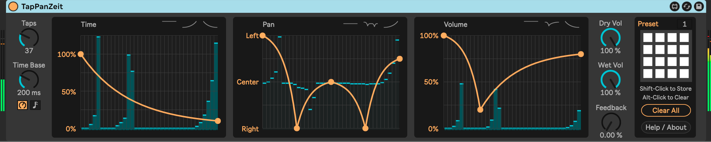

# m4l-TapPanVerb

This is an audio effect made in Max For Live that implements a reverb + bucket-brigade multitap (up to 128 individual taps) delay effect with visual control over inter-tap timing and pan position. It can serve as a simple reverb, simple delay, or incredibly complicated combination of the two.

I originally had an idea that there should be a function in a reverb that lets you control the pan position of the reverb tail at specific times after the initial impulse. I didn't find that in the reverbs that I had, so I decided to mock one up. My first attempt was to use an audio effect rack with five chains spread across the stereo range. Each chain had a delay followed by a reverb. The chain delay increased in some increment across the chains, e.g. chain 1 was 0ms delay, chain 2 was 100ms, chain 3 was 200ms, etc. This had the effect of making "reverb bursts" across the stereo field, which was cool. But it wasn't what I had in mind exactly.

This device is as close as I can figure out how to do this at this point. There is a configurable number of taps (up to 128) that are spaced at a configurable time interval. There are visual controls for pan position and time coefficient that give you very direct control over some wild effects. There is a reverb section, which actually sits in front of the signal before the delay taps. This lets you pre-blur the sound as it goes into the delay circuit. There is also a feedback function with a novel musicality, but it is still super dangerous to use! USE WITH CARE!

## Demos

(make sure you enable audio in each video window)

https://user-images.githubusercontent.com/8418898/167030877-89e855ee-bd85-4da1-a519-e21bc99074d7.mov

You can see more demos linked on the [blog post on TapPanVerb](https://steinkamp.us/post/2022/05/05/TapPanVerb.html) page.

## Installation / Setup

If you just want to download and install the device, then go to the [Releases Page](https://github.com/zsteinkamp/m4l-TapPanVerb/releases) and download the newest version there.

### Changelog

* [v6](https://github.com/zsteinkamp/m4l-TapPanVerb/releases/download/v6/TapPanVerb-v6.amxd) - 2024-10-17 - Add presets; Tighten up UI a bit.
* [0.0.5](https://github.com/zsteinkamp/m4l-TapPanVerb/raw/main/frozen/TapPanVerb-0.0.5.amxd) - 2022-05-19 - Show taps in time/pan/volume areas as vertical lines.
* [0.0.4](https://github.com/zsteinkamp/m4l-TapPanVerb/raw/main/frozen/TapPanVerb-0.0.4.amxd) - 2022-05-15 - Add functionality to draw per-tap output level.
* [0.0.3](https://github.com/zsteinkamp/m4l-TapPanVerb/raw/main/frozen/TapPanVerb-0.0.3.amxd) - 2022-05-06 - Optimize CPU usage by using `mute 0/1` messages for `poly~` voices rather than just setting their volume to 1 or 0.
* [0.0.2](https://github.com/zsteinkamp/m4l-TapPanVerb/raw/main/frozen/TapPanVerb-0.0.2.amxd) - 2022-05-06 - Visual changes; add feedback mod rate dial.
* [0.0.1](https://github.com/zsteinkamp/m4l-TapPanVerb/raw/main/frozen/TapPanVerb-0.0.1.amxd) - 2022-05-05 - Initial release.

## Usage

### Taps
This knob controls how many taps are in the tap field.

### Delay Base
This knob controls the default delay between each tap in the field.

### Feed Forward
The taps are arranged in a bucket-brigade, that is tap 1 outputs its signal both to the plugin output, but also as the input to tap 2. The volume of the signal that is sent to the subsequent tap is scaled according to this knob. Set to 100% to hear each tap equally loudly.

### Tap Time Factor
This is a visual input to control each tap's relative delay time. Pull the line toward zero to speed up the taps, or up to one to slow it back down. Shift-click to remove points. Alt-drag to adjust curve.

### Reverb Mix
Crossfades between dry input signal and that signal put through a reverb.

### Reverb Size
Controls a feedback loop inside of the reverb circuit. Larger numbers will result in a longer reverb.

### Brightness
Controls whether the reverb sounds dark or bright.

### Panning Path
This is a visual control that lets you position each tap in stereo space.  Draw a line to indicate where, from left to right, each tap should be placed. Shift-click to remove points. Alt-drag to adjust curve.

### FB Amount
This knob controls how much of the output signal is fed back into the pre-reverb section.

### FB Delay
Allows for some control over the resonant frequencies of the feedback circuit. The circuit has an oscillating delay to try to mitigate ringing, and this knob controls its midpoint and scale (+/-50%).

### FB Rate
Controls the rate of the LFO that is modulating the feedback delay time.

### Tap Output Volume
This controls the output of each tap, so you can make the taps fade in or out or anything in between. Shift-click to remove points. Alt-drag to adjust curve.

## TODO

* ...

## Contributing

I'd love it if others extended this device. If you would like to contribute, simply fork this repo, make your changes, and open a pull request and I'll have a look. Or if you have ideas or something to add to the to-do list above, just open an issue here or email me at [zack@steinkamp.us](mailto:zack@steinkamp.us).

